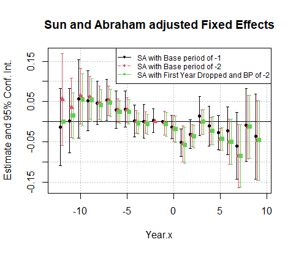
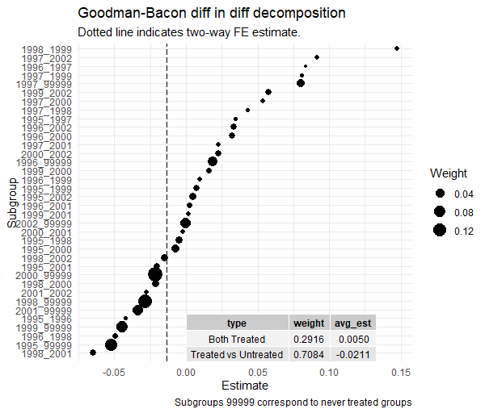

```{r setup, include=FALSE}
knitr::opts_chunk$set(echo = TRUE)
library(kableExtra)
```

\newpage

## Introduction

In 2023, it has been estimated that at least 58.7 million adults in the United States had some sort of mental illness. In the same year, 14.6 million were estimated to have a serious mental illness that resulted in serious functional impairment or interfered with at least one or more major life activities. Only 66.7% of those 14.6 million received any mental health treatment in the past year. According to the Centers for Disease Control's (CDC) WISQARS Leading Causes of Death Report, Suicides are the second leading cause of death amongst people aged 10-34 and are ranked as the 11th overall. Suicide rates have gradually increased over the past two decades, starting with 10.5 per 100,000 people to 14.2 per 10,000 in 2018. Suicide rates vary from state to state with both east and west coasts supporting low rates such as 7.4 per 100,000 while mid-western states suffer from rates as high as 25 per 100,000. This within-state variation typically is not a problem for modern economists using two-way fixed effects. More recently in the econometrics literature, more attention has been given to the problem of dynamic timing of federal policies and the potential bias it might bring to traditional two-way fixed effects. In this paper, I attempt to replicate @lang2013 findings of the effects of the Mental Health Parity Act of 1996 using @sun2021, @callaway2021, and @goodman-bacon2021 as a way to estimate the average treatment effect while deconstructing the two-way fixed effect regression. Additionally, I use several propensity score measures to compare to newer methods. I find that traditional methods are in line with previous results while dynamic timing methods estimate somewhere at 3% or 5% depending on the method and base period used. [@klick2006; @centers]

### Lang (2013)

@lang2013 attempts to identify causal effects using difference-in-difference methods and fixed effects using policy shocks resulting from the aftereffects of the Federal Health Parity Act of 1996. @lang2013 showed a statistically significant effect of a 4-7% decrease in suicide rate after policy implementation using two-way fixed effects. To do this with the rollout of policies from the states, @lang2013 set 1998 as \$t_0\$ since most were enacted afterward. I draw the same data detailed in the study while using more modern statistical methods that surround difference in differences. I run my difference in difference using regression similar to @lang2013 in addition to conducting propensity score matching methods to achieve a better balance between covariates between control and treatment states. I also used more dynamic difference-in-differences methods using the data and found similar results as the preliminary difference-in-differences and Two-way Fixed Effects.

### Mental Health Parity Act

In 1996, Congress pushed forward legislation, sponsored by Senator Pete V. Domenici, to address rising concerns about mental health and how insurers treat those with mental health issues. The aim of the Federal Mental Health Parity Act of 1996 was to provide equal treatment of regular physical services and psychological services. With the MHPA, Congress banned group insurance plans that have a lower annual or lifetime dollar cap for mental health services if they offered mental health services. However, subsequent reports from the General Accounting Office (GAO) concerning the MHPA put into question whether or not the federal law had any effect. @GAO2000 While firms were complying with the letter of the law, the law itself was narrow enough that insurers could offset costs by limiting mental health services through several avenues known as Quantitative Treatment Limits. According to the survey the GAO conducted, most employers began offering mental health plans that were more restrictive with in-treatment stays with mental health services than regular treatment. Others offered one or two more unique plans and designs that were as equally restrictive. While disappointing results for federal lawmakers, most states in 2002 instated mental health parity laws alongside further stipulations with varying degrees of restrictiveness and exemptions. [@samsha2023; @GAO2000]

### Parity laws:

Any state implementing a law that requires insurance packages to include access to mental health services and to have those services at parity with any other physical service is flagged as a parity state. This type of law is the strongest type among the ones implemented and is the type expected to create an effect this study investigates. A less strict version of the parity law is the "mandated offering" law, which does not force insurance package providers to provide mental health services in the first place. This can be a crucial difference when it comes to further analysis but for the purposes of this study, both are lumped together as a Parity state.

## Data

My data set pulls from the same sources from @lang2013 with the exception of one variable. The data set is a sample of 15 years from 1990 to 2004 in 50 states including the District of Columbia. In total, the entire matrix is 765 observations. I have 6 main variables, the first of which is the main outcome variable logged crude suicide rate. I pull from the CDC WONDER database @centers for the compressed mortality statistics. Both queries included anything that was labeled intentional self-harm fatalities in both ICD-9 and ICD-10. The same database also contained crude population statistics for each state in that given year. The Unemployment rate was obtained through The Current Population Survey. Bankruptcy statistics were obtained through the US bankruptcy court tables converted into Excel data and coded from the available population statistics. Percent Workers from large firms variable was created from the County Business Patterns Survey obtained through the US census website.

Further variables were hand-coded for the analysis. Information regarding the policy status of states during which years was taken from the appendix of @lang2013. Binary variables were created that denoted the status of a parity or non-parity law in place including the type of parity law enacted. Lastly, I created a variable that denoted the exact year where a parity law was enacted for each state which serves as a grouping variable for the @callaway2021 analysis.

### Summary Statistics

Table 1 details the weighted averages for the data set. The crude rate of suicides per 100k of the population was 11.32. The weighted mean log suicide rate was 2.4. The mean unemployment rate was 5.6. Mean bankruptcies per 100k is 436. The mean percent of workers in large firms in the data is 48%.

Table 2 subsets the data into 3 categories, Pre-Parity, Post-Parity, and No-Parity group. In the pre-parity group, the suicide rate was 10.85 while the post-parity suicide rate decreased to 9.84. The No-Parity Group had a weighted average of 12.57 throughout the data set's time period.

### @lang2013 Simple Difference in Differences

Table 3 replicates the summary statistics found in @lang2013 and uses the @lang2013 method of implementing the difference in difference intervention in the year 1998. Here the weighted mean suicide rates of the pre and post-treatment group are 11.08 and 9.8 respectively. The pre and post-control group weighted means additionally stand at 12.89 and 12.43. Table 4 displays the weighted mean log suicide rates in a similar fashion.

Table 5 Introduces the simple difference-in-differences design that is explored in @lang2013. Both panels are averages weighted by state populations that denote pre and post-group cutoff between the two periods of 1990-1997 and 1998-2004. Standard errors are reported in parenthesis and in brackets are the number of observations that fall in this group. @lang2013 uses this specification to conduct the analysis for the rest of his regressions. I replicate the main Difference-in-Difference results in both panels with a slightly higher Panel A result at -.65 per 100k decrease in suicides and a Panel B result at a similar 8%. Both are significant at the same levels in @lang2013 Table 3.

### My Difference in Difference

For the rest of this analysis, I will not be using the intervention timing assumption cut-off in order to conduct the rest of the regressions. All groups in the regressions after this point are accurate to the year they were implemented. That is to say, while @lang2013 had to treat treated states as if they were passed in 1998 in order for the difference-in-difference framework to function, I am afforded the liberty of using the dynamic difference-in-difference. Additionally, I've excluded things included in @lang2013 due to the author stating they had no impact on the main results. These include a lagged suicide rate timing control and dropping observations of states that passed a parity law in the middle of the year. Table 4 Column 2 also dropped observations so that only states that eventually become treated are left. I replicated this column with the data included and found no difference in the investigated effect.

## Replicating Lang 2013

$$
Suicide_{st}= \alpha +\beta_{1}Access_{st}+\beta_{2}NonParityLaw_{st}+\delta X_{st}+\gamma_{s}+\pi_t +\varepsilon_{st}
\tag{1}
$$

I used the typical panel approach in all the subsequent analyses unless stated otherwise. My dependent variable is denoted by $Suicide_{st}$ which is the log crude suicide rate per 100,000 people in the state \$s\$ and year $t$. The $Access_{st}$ term denotes an Access to Parity Law in effect over the state $s$ and time period $t$. $NonParityLaw_{st}$ term denotes a non-parity law, either a is in effect at state $s$ and year $t$. $X_{st}$ denotes unemployment, bankruptcy, and large firm controls. The $\gamma_{s}$ and $\pi_{t}$ are the state and yearly fixed effects respectively.

## TWFE, MATCHING and Heterogeneous Treatment Effects

### TWFE

Table 6 details a replication of Table 4 of @lang2013. Regressing the log suicide rate, The first column returns a similar estimate to the first column of Table 4 in \@lang2013. I find a 4.2% decrease in the suicide rate compared to @lang2013 5% for Access to Parity states. The second column replicates the same column in @lang2013 finding another 4% reduction. We chose not to reduce our sample size for this column since both regressions report the same coefficient. Column (3) distinguishes itself from the rest of the regressions as the only model that loses the significance of the main variable and does not replicate from @lang2013. Column (3) of Table 6 also shows Mandated offering laws significant for a 9% decrease in the log suicide rate compared to @lang2013 12%. Column (4) continues with the Access to Parity variable significant at the 5% level with a coefficient of 4.6% compared with @lang2013 7%. Overall, I see a similar or reduced magnitude in the estimated effect.

### Matching

My first extension to @lang2013 uses the assumption of a 1998 treatment time from @lang2013 and adds matching to the difference-in-differences model as a robustness check. I run several different matching methods available to the @MatchIt package.

Tables 7, 8, and 9 detail Difference-in-Differences regressions using two-way fixed effects. The same as previous models, variables are weighted by population at that state's point in time and additionally are clustered at the state level. Columns 1 and 2 detail the Difference in Difference models using Mahalanobis distance, switching between the regular and logged suicide rate. Columns 3 and 4 show models matched with a probit method. The only significant effect was found in column 4 with a -4% decrease associated with the post-treatment effect. Table 8 features GLM in columns 1 and 2 with the only significant effect belonging to column 2, finding the same coefficient as Table 7 Column 4. Columns 3 and 4 showcase models with Cardinality matching and find no significant effects. Table 9 Uses Coarse-Exact matching and Subclass matching to find the same coefficient in column 4. Overall every matching method that either cut down on the observations or didn't use a logged crude rate did not retrieve significant effects.

### Dynamic treatment Effects

The second extension to @lang2013 I bring is a dive into dynamic treatment effects using both @sun2021 and @callaway2021 to see if a roll-out design can capture the same effects found in the previous regressions. Here we can evaluate the effect on each state's access to parity policy without worrying about introducing contamination through comparisons of past and future treated units. I will first Introduce the @sun2021 results compare them with @callaway2021 results and complete the discussion with the @goodman-bacon2021 decomposition.

#### Interaction-weighted estimates (Sun and Abraham 2021)

Table 10 displays the results of 3 models run with varying base periods. All regressions use the parity law group variable that tracks the first year of each policy implementation. The first model with a base period of -1 does not return a significant ATT when evaluating parity law policy. The second column does return a significant effect of a 3% decrease in suicides with a base period of -2. The third column follows a suggestion of dropping the first year of the data set from @sun2021 to add more control units, resulting in a similar 3% decrease in suicides.

#### Difference in Difference with Multiple Time Periods (Callaway and Sant'Anna)

Table 11 contains the estimates for @callaway2021. All regressions use the parity law group timing discussed in the last section. Columns 1, 2, and 4 arrive at similar estimates of a 5% decrease in suicides, the first two using the universal base period while Column 3 uses a varying base period. In column 4, I experimented with setting different anticipation periods and saw results at a significant 3% decrease in suicides with the anticipation setting at -1.

### Goodman-Bacon

Figure 2 shows the results of the @goodman-bacon2021 decomposition graph breakdown of the weights involved in a Two-way Fixed Effects Regression on the log suicide rate without population weighting. From the graph we can show that most of the treated vs untreated comparisons make up most of the weight on the ATT, only 30% of comparisons made consist of those "forbidden" comparisons of early vs later treated that can introduce contaminated results. The ATT estimated was -1.35%.

## Conclusion

My findings concur with the findings of the seminal paper @lang2013 and estimate a negative 3-5% effect on suicides. Borrowing from @lang2013 back of the hand math, 29 states had a suicide rate of 10.24 and a total population of 160 221 455. A decrease of 3% to 5% would save between 492 to 820 lives nationally per year. The mechanism behind the results was the political shock resulting from passing the Mental Health Parity Act of 1996. As explained in @harrison2002, the passing of the MHPA created state incentives to pass their own version of mental health parity law to bypass federal oversight. This is due to a provision in the law that, so long the state fulfills the minimum requirements, states retain the authority to regulate parity laws. This resulted in the wave of states implementing parity laws afterward.

One of the main limitations of this study revolves around the 1 in 10 rule for judging how many controls can a model handle before the model is in danger of overfitting. In the case of the regular two-way fixed effects, we have 3 main controls while we have 66 total state and year controls with a $n$ of 765 resulting in a rough ratio of 11 observations per control. This is pretty close to the acceptable line. For the newer methods, we have a total of 112 controls, for a cohort of 8 treatment years multiplied by the 14 years taken into consideration, dropping the first year of each cohort. This results in a ratio of roughly 7 observations per control, firmly below the rule of thumb. This and a combination of some cohorts having less than 30 observations causes logistic regression used by @callaway2021 and their doubly robust methods return blown-up standard errors and missing values.

Policy implications are straightforward. Stronger, more restrictive laws that provide means towards healthcare utilization make for a stronger suicide rate reduction. The more services offered by insurers, the more treatment people get. If full parity granted in 29 states resulted in a national 5% reduction in the suicide rate even for just two years as the research implies, it's worth pursuing politically. Newer research using quality microdata would be a powerful way of working with the question of the effectiveness of mental health parity. Papers like @ortega2023, which study Medicaid expansion while using dynamic differences-in-differences, are a great framework using modern data with modern statistics. Future research should focus on the new 2024 Federal Parity rules that the Biden administration has implemented to combat non-quantitative treatment limitations that insurers use to limit utilization.

\newpage

## Figures

```{=latex}
\begin{table}[!htbp] \centering \renewcommand*{\arraystretch}{1.1}\caption{Summary Statistics}\resizebox{\textwidth}{!}{
\begin{tabular}{lrrrrrrr}
\hline
\hline
Variable & N & Wt. Mean & Wt. SD & Min & Pctl. 25 & Pctl. 75 & Max \\ 
\hline
Suicide Rate & 765 & 11.32 & 2.681 & 4.021 & 10.59 & 13.98 & 24.97 \\ 
Log suicide rate & 765 & 2.398 & 0.2415 & 1.392 & 2.36 & 2.638 & 3.218 \\ 
Unemployment rate & 765 & 5.573 & 1.421 & 2.108 & 4.267 & 6.192 & 11.23 \\ 
Bankrupcy rate per 100k & 765 & 435.6 & 169.5 & 79.46 & 287.6 & 516.5 & 1117 \\ 
Percent of workers in large Firms & 765 & 0.483 & 0.03803 & 0.2699 & 0.4291 & 0.5025 & 0.5711\\ 
\hline
\hline
\end{tabular}
}
\end{table}
```
```{=latex}
\begin{table}[!htbp] \centering \renewcommand*{\arraystretch}{1.1}\caption{Summary Statistics}\resizebox{\textwidth}{!}{
\begin{tabular}{lrrrrrrrrr}
\hline
\hline
Pre\_Post\_Parity & \multicolumn{3}{c}{No-Parity} & \multicolumn{3}{c}{Post-Parity} & \multicolumn{3}{c}{Pre-Pairty}  \\ 
 Variable & \multicolumn{1}{c}{N} & \multicolumn{1}{c}{Wt. Mean} & \multicolumn{1}{c}{Wt. SD} & \multicolumn{1}{c}{N} & \multicolumn{1}{c}{Wt. Mean} & \multicolumn{1}{c}{Wt. SD} & \multicolumn{1}{c}{N} & \multicolumn{1}{c}{Wt. Mean} & \multicolumn{1}{c}{Wt. SD} \\ 
\hline
Suicide Rate & 330 & 12.57 & 2.263 & 178 & 9.848 & 2.583 & 257 & 10.85 & 2.548 \\ 
Log suicide rate & 330 & 2.517 & 0.1696 & 178 & 2.255 & 0.2545 & 257 & 2.356 & 0.2385 \\ 
Unemployment rate & 330 & 5.338 & 1.288 & 178 & 5.134 & 1.113 & 257 & 6.131 & 1.568 \\ 
Bankrupcy rate per 100k & 330 & 442.5 & 188.5 & 178 & 476.1 & 169.3 & 257 & 401.3 & 137.3 \\ 
Percent of workers in large Firms & 330 & 0.4887 & 0.03845 & 178 & 0.4886 & 0.03846 & 257 & 0.4727 & 0.03511\\ 
\hline
\hline
\end{tabular}
}
\end{table}
```
```{=latex}
\begin{table}

\caption{Weighted Mean Suicide Rates of Treated and Nontreated States, Pre and Post Period for (Lang2013) Difference in Difference}
\centering
\begin{tabular}[t]{lrrrr}
\toprule
Time Period Group & mean & st.err & sd & n\\
\midrule
NoTreatPost-Period & 12.2426 & 0.2118 & 2.0905 & 154\\
NoTreatPre-Period & 12.8921 & 0.2264 & 2.3786 & 176\\
Post-Period & 9.7867 & 0.2927 & 2.5778 & 203\\
Pre-Period & 11.0831 & 0.2616 & 2.4765 & 232\\
\bottomrule
\end{tabular}
\end{table}
```
```{=latex}
\begin{table}

\caption{Weighted Mean Log Suicide Rates of Treated and Nontreated States, Pre and Post Period (Lang2013) Difference in Difference}
\centering
\begin{tabular}[t]{lrrrr}
\toprule
Time Period Group & mean & st.err & sd & n\\
\midrule
NoTreatPost-Period & 2.4915 & 0.0165 & 0.1625 & 154\\
NoTreatPre-Period & 2.5413 & 0.0165 & 0.1732 & 176\\
Post-Period & 2.2485 & 0.0288 & 0.2537 & 203\\
Pre-Period & 2.3800 & 0.0241 & 0.2285 & 232\\
\bottomrule
\end{tabular}
\end{table}
```
```{=latex}
\begin{table}
\raggedleft
\caption{\small{Difference in Difference estimates of the impact of access to parity mandates on suicide rates:(Lang2013) Replication}}
\label{tab:my_label}
 \begin{tabular}{ccccccc}
 \toprule
 \multicolumn{7}{c}{Panel A}\\ 
 \midrule
         State/ Type Period&  &  1990-1997&  &  1998-2004&  &difference between periods\\ 
         \midrule
         Access to Parity States&  &  11.083&  &  9.787
&  &-1.2964\\ 
         &  &  (.262)&  &  (.293)
&  &(0.2272)  \\ 
         &  &  [232]&  & [203]&  &\\ 
         No Parity States/ No Law States&  &  12.892
&  &  12.2426
&  &0.6495\\ 
 & & (0.226)
& & (0.212)
& &(0.2730)\\ 
 & & [154]& & [176]& &\\ 
 Difference between types of states& & -1.809& & -2.456     & &\\ 
 & & (0.2481)   & & (0.2541)   & &\\ 
 Difference in Difference& & & -.647*& & &\\ 
 & & & (0.3552)  & & &\\
 \toprule
 \multicolumn{7}{c}{Panel B}\\
 \midrule
 State/ Type Period& & 1990-1997& & 1998-2004& &difference between periods
 \\\midrule
 Access to Parity States& & 2.380& & 2.249 
& &-.131\\
 & & (.024)& & 
(.029)& &(.0202)\\
 & & [232]& & [203]& &\\
 No Parity States/ No Law States& & 2.541
& & 2.492& &-.049\\
 & & (.0165)
& & 
(.0165)& &(.02422)\\
 & & [176]& & [154]& &\\
 Difference between types of states& & -.161& & 
-.243& &
\\
 & & (.022)& & (.0226)& &
\\
 Difference in Difference& & & -.0817***& & &
\\
 & & & (.032)& & &\\
 \bottomrule
    \end{tabular}
\small {Each cell contains the average suicide rate/log suicide rate for the specified group that are weighted by yearly state population. \\Standard errors are reported in parentheses; sample sizes are reported in brackets.\\Signif. Codes: ***: 0.01, **: 0.05, *: 0.1
}
\end{table} 
```
```{=latex}

\begin{table}[htbp]
   \caption{The Two-way Fixed Effect Regressions on the Impact of Mental Health Parity Laws }
   \centering
   \begin{tabular}{lcccc}
      \tabularnewline \midrule \midrule
      Dependent Variable: & \multicolumn{4}{c}{Log Suicide Rate}\\
      Model:                         & (1)                     & (2)                     & (3)                     & (4)\\  
      \midrule
      \emph{Variables}\\
      Access To Parity         & -0.0418$^{***}$         & -0.0411$^{***}$         &                         & -0.0461$^{**}$\\   
                               & (0.0129)                & (0.0131)                &                         & (0.0186)\\   
      Non Parity Law           & -0.0019                 &                         &                         &   \\   
                               & (0.0134)                &                         &                         &   \\   
      Unemployment Rate        & 0.0152$^{***}$          & 0.0152$^{***}$          & 0.0151$^{***}$          & 0.0155$^{***}$\\   
                               & (0.0049)                & (0.0049)                & (0.0049)                & (0.0049)\\   
      Bankrupcy Per 100k       & 0.0002$^{***}$          & 0.0002$^{***}$          & 0.0003$^{***}$          & 0.0002$^{***}$\\   
                               & ($4.38\times 10^{-5}$)  & ($4.41\times 10^{-5}$)  & ($4.26\times 10^{-5}$)  & ($4.29\times 10^{-5}$)\\    
      PercW                    & 0.6413                  & 0.6406                  & 0.5383                  & 0.6499\\   
                               & (0.4625)                & (0.4636)                & (0.4542)                & (0.4739)\\   
      Parity Law Passed        &                         &                         & -0.0319                 &   \\   
                               &                         &                         & (0.0199)                &   \\   
      Mandated offering laws   &                         &                         & -0.0897$^{***}$         &   \\   
                               &                         &                         & (0.0241)                &   \\   
      Mandated if Offered      &                         &                         & -0.0220                 & -0.0220\\   
                               &                         &                         & (0.0179)                & (0.0179)\\   
      No Parity Law            &                         &                         & -0.0035                 & -0.0043\\   
                               &                         &                         & (0.0146)                & (0.0148)\\   
      \midrule
      \emph{Fixed-effects}\\
      State                    & Yes                     & Yes                     & Yes                     & Yes\\  
      Year.x                   & Yes                     & Yes                     & Yes                     & Yes\\  
      \midrule
      \emph{Fit statistics}\\
      Observations             & 765                     & 765                     & 765                     & 765\\  
      R$^2$                    & 0.94704                 & 0.94704                 & 0.94836                 & 0.94715\\  
      Within R$^2$             & 0.21667                 & 0.21664                 & 0.23619                 & 0.21825\\  
      \midrule \midrule
      \multicolumn{5}{l}{\emph{Clustered (State) standard-errors in parentheses}}\\
      \multicolumn{5}{l}{\emph{Signif. Codes: ***: 0.01, **: 0.05, *: 0.1}}\\
   \end{tabular}
\end{table}
```
\newpage

\newpage

```{=tex}

\begin{table}[htbp]
\centering
\caption{Matched Table A}
\resizebox{\textwidth}{!}{%
\begin{tabular}{lcccc}
   \tabularnewline \midrule \midrule
   Dependent Variables:           & Crude Suicide Rate & Log Suicide Rate        & Crude Suicide Rate & Log Suicide Rate\\  
   Matching Model:                & Mahalanobis        & Mahalanobis             & Full with Probit   & Full with Probit \\  
   \midrule
   \emph{Variables}\\
   TreatPost                      & 0.060              & -0.015                  & -0.279             & -0.043$^{***}$\\   
                                  & (0.329)            & (0.028)                 & (0.176)            & (0.015)\\   
   `unemploymentrate`             & 0.229$^{*}$        & 0.027$^{**}$            & 0.121$^{**}$       & 0.014$^{***}$\\   
                                  & (0.126)            & (0.011)                 & (0.057)            & (0.005)\\   
   Bankruptcy Per 100,000         & 0.0007             & $5.64\times 10^{-5}$    & 0.003$^{***}$      & 0.0003$^{***}$\\   
                                  & (0.0006)           & ($4.79\times 10^{-5}$)  & (0.0005)           & ($4.25\times 10^{-5}$)\\    
   Percent Working in Large Firms & 6.05               & 0.539                   & -0.346             & 0.548\\   
                                  & (8.36)             & (0.788)                 & (4.43)             & (0.435)\\   
   \midrule
   \emph{Fixed-effects}\\
   State                          & Yes                & Yes                     & Yes                & Yes\\  
   Year.x                         & Yes                & Yes                     & Yes                & Yes\\  
   \midrule
   \emph{Fit statistics}\\
   Observations                   & 284                & 284                     & 765                & 765\\  
   R$^2$                          & 0.96644            & 0.96979                 & 0.94241            & 0.94692\\  
   Within R$^2$                   & 0.03924            & 0.06029                 & 0.14513            & 0.21481\\  
   \midrule \midrule
   \multicolumn{5}{l}{\emph{Clustered (State) standard-errors in parentheses}}\\
   \multicolumn{5}{l}{\emph{Signif. Codes: ***: 0.01, **: 0.05, *: 0.1}}\\
\end{tabular}%
}
\end{table}

\begin{table}[htbp]
\centering
\caption{Matched Table B}
\resizebox{\textwidth}{!}{%
\begin{tabular}{lcccc}
   \tabularnewline \midrule \midrule
   Dependent Variables:           & Crude Suicide Rate & Log Suicide Rate        & Crude Suicide Rate & Log Suicide Rate\\  
   Matching Model:                & Full with GLM     & Full with GLM            & Full with Cardinality & Full with  Cardinality\\  
   \midrule
   \emph{Variables}\\
   TreatPost                      & -0.279             & -0.043$^{***}$          & -0.103             & -0.038\\   
                                  & (0.176)            & (0.015)                 & (0.408)            & (0.038)\\   
   `unemploymentrate`             & 0.121$^{**}$       & 0.014$^{***}$           & 0.418$^{***}$      & 0.039$^{***}$\\   
                                  & (0.057)            & (0.005)                 & (0.136)            & (0.013)\\   
   Bankruptcy Per 100,000         & 0.003$^{***}$      & 0.0003$^{***}$          & 0.0002             & $-1.08\times 10^{-5}$\\    
                                  & (0.0005)           & ($4.25\times 10^{-5}$)  & (0.0009)           & ($8.48\times 10^{-5}$)\\    
   Percent Working in Large Firms & -0.346             & 0.548                   & 17.8$^{**}$        & 1.84$^{**}$\\   
                                  & (4.43)             & (0.435)                 & (8.07)             & (0.803)\\   
   \midrule
   \emph{Fixed-effects}\\
   State                          & Yes                & Yes                     & Yes                & Yes\\  
   Year.x                         & Yes                & Yes                     & Yes                & Yes\\  
   \midrule
   \emph{Fit statistics}\\
   Observations                   & 765                & 765                     & 168                & 168\\  
   R$^2$                          & 0.94241            & 0.94692                 & 0.97177            & 0.97352\\  
   Within R$^2$                   & 0.14513            & 0.21481                 & 0.12200            & 0.16782\\  
   \midrule \midrule
   \multicolumn{5}{l}{\emph{Clustered (State) standard-errors in parentheses}}\\
   \multicolumn{5}{l}{\emph{Signif. Codes: ***: 0.01, **: 0.05, *: 0.1}}\\
\end{tabular}%
}
\end{table}


\begin{table}[htbp]
\centering
\caption{Matched Table C}
\resizebox{\textwidth}{!}{%
\begin{tabular}{lcccc}
   \tabularnewline \midrule \midrule
   Dependent Variables:           & Crude Suicide Rate & Log Suicide Rate        & Crude Suicide Rate & Log Suicide Rate\\  
   Matching Model:                & Coarse-Exact Matching & Coarse-Exact Matching & Subclass           & Subclass\\  
   \midrule
   \emph{Variables}\\
   TreatPost                      & -0.156             & -0.027                  & -0.279             & -0.043$^{***}$\\   
                                  & (0.217)            & (0.020)                 & (0.176)            & (0.015)\\   
   `unemploymentrate`             & 0.108              & 0.018                   & 0.121$^{**}$       & 0.014$^{***}$\\   
                                  & (0.119)            & (0.012)                 & (0.057)            & (0.005)\\   
   Bankruptcy Per 100,000         & 0.002$^{**}$       & 0.0002$^{**}$           & 0.003$^{***}$      & 0.0003$^{***}$\\   
                                  & (0.0007)           & ($7.95\times 10^{-5}$)  & (0.0005)           & ($4.25\times 10^{-5}$)\\    
   Percent Working in Large Firms & -6.37              & -0.002                  & -0.346             & 0.548\\   
                                  & (7.16)             & (0.666)                 & (4.43)             & (0.435)\\   
   \midrule
   \emph{Fixed-effects}\\
   State                          & Yes                & Yes                     & Yes                & Yes\\  
   Year.x                         & Yes                & Yes                     & Yes                & Yes\\  
   \midrule
   \emph{Fit statistics}\\
   Observations                   & 319                & 319                     & 765                & 765\\  
   R$^2$                          & 0.96784            & 0.96903                 & 0.94241            & 0.94692\\  
   Within R$^2$                   & 0.07776            & 0.10345                 & 0.14513            & 0.21481\\  
   \midrule \midrule
   \multicolumn{5}{l}{\emph{Clustered (State) standard-errors in parentheses}}\\
   \multicolumn{5}{l}{\emph{Signif. Codes: ***: 0.01, **: 0.05, *: 0.1}}\\
\end{tabular}%
}
\end{table}
```
\newpage

\newpage

```{=tex}

\begin{table}[htbp]
   \caption{Sun and Abraham Estimates}
   \centering
   \begin{tabular}{lccc}
      \tabularnewline \midrule \midrule
      Dependent Variable: & \multicolumn{3}{c}{lcruderate}\\
      Model:             & (Base Period: -1)                     & (Base Period: -2)                     & (BP:-2| First Year Dropped)\\  
      \midrule
      \emph{Variables}\\
      Unemployment Rate & 0.0148$^{***}$          & 0.0148$^{***}$          & 0.0152$^{***}$\\   
                         & (0.0053)                & (0.0053)                & (0.0052)\\   
      Bankrupcy per 100k     & 0.0003$^{***}$          & 0.0003$^{***}$          & 0.0003$^{***}$\\   
                         & ($7.04\times 10^{-5}$)  & ($7.04\times 10^{-5}$)  & ($7.01\times 10^{-5}$)\\    
      Percent Working in Large Firms              & 0.1840                  & 0.1840                  & 0.2052\\   
                         & (0.2827)                & (0.2827)                & (0.2760)\\   
      ATT                & -0.0214                 & -0.0306$^{**}$          & -0.0317$^{**}$\\   
                         & (0.0153)                & (0.0126)                & (0.0126)\\   
      \midrule
      \emph{Fixed-effects}\\
      State              & Yes                     & Yes                     & Yes\\  
      Year.x             & Yes                     & Yes                     & Yes\\  
      \midrule
      \emph{Fit statistics}\\
      Observations       & 765                     & 765                     & 765\\  
      R$^2$              & 0.95810                 & 0.95810                 & 0.95798\\  
      Within R$^2$       & 0.38016                 & 0.38016                 & 0.37840\\  
      \midrule \midrule
      \multicolumn{4}{l}{\emph{Clustered (State) standard-errors in parentheses}}\\
      \multicolumn{4}{l}{\emph{Signif. Codes: ***: 0.01, **: 0.05, *: 0.1}}\\
   \end{tabular}
\end{table}
```
\newpage

\newpage

```{r eval=FALSE, message=FALSE, warning=FALSE, include=FALSE, paged.print=TRUE}
library(tidyverse)
results <-read.csv("CStidysimpleresults.csv")
results2 <-read.csv("CStidygroupresults.csv")
results3 <- rbind(results,results2)

#results3 %>%
 # t() %>%
#  write.csv2(file = "CSResults.csv")

CSRegressiontable <- read.csv2("CSregressiontable.csv")
CSRegressiontable <- CSRegressiontable %>% 
  rename( "No Covariates" =No.Covariates ,
   "Varying Base Period" =Varying.Base.Period 
)
  

#kable(results3, booktabs = T,caption = "Calloway and Sant'Anna Estimates") %>%
#  kable_styling()   %>%
#  pack_rows("Weighted Average Group",1,3) %>%
 # pack_rows("Group Average",4,6) 

kable(CSRegressiontable,"latex", booktabs = T,caption = "Calloway and Sant'Anna Estimates") %>%
  kable_styling(latex_options = "hold_position")   %>%
  pack_rows("Weighted Average Group",1,2) %>%
  pack_rows("Group Average",3,4) %>%
  save_kable(file = "CSRegressiontable.tex")

  
```

```{=tex}
\begin{table}[!h]
\centering
\caption{Calloway and Sant'Anna Estimates}
\centering
\begin{tabular}[t]{lllll}
\toprule
Regression & No Covariates & Covariates & Varying Base Period & Anticipation Periods:-1\\
\midrule
\addlinespace[0.3em]
\multicolumn{5}{l}{\textbf{Weighted Average Group}}\\
\hspace{1em}Estimate & -0.0520$^{***}$  & -0.0521$^{***}$  & -0.0521$^{***}$ & -0.0303$^{*}$ \\
\hspace{1em}Std.error & (0.0181) & (0.0185) & (0.0177) & ( 0.0132) \\
\addlinespace[0.3em]
\multicolumn{5}{l}{\textbf{Group Average}}\\
\hspace{1em}Estimate & -0.0532$^{***}$  & -0.0523$^{***}$  & -0.0523$^{***}$ & -0.0301$^{*}$  \\
\hspace{1em}Std.error & (0.0143) & (0.0143) & (0.0149) & (0.0087)\\
\bottomrule
\multicolumn{3}{l}{\emph{Clustered (State) standard-errors in parentheses}}\\
      \multicolumn{3}{l}{\emph{Signif. Codes: ***: 0.01, **: 0.05, *: 0.1}}\\
\end{tabular}
\end{table}
```
\newpage

\newpage

Figure 1.



\newpage

\newpage

Figure 2.



\newpage

Figure 3.


\newpage

Figure 4.


\newpage

## References
