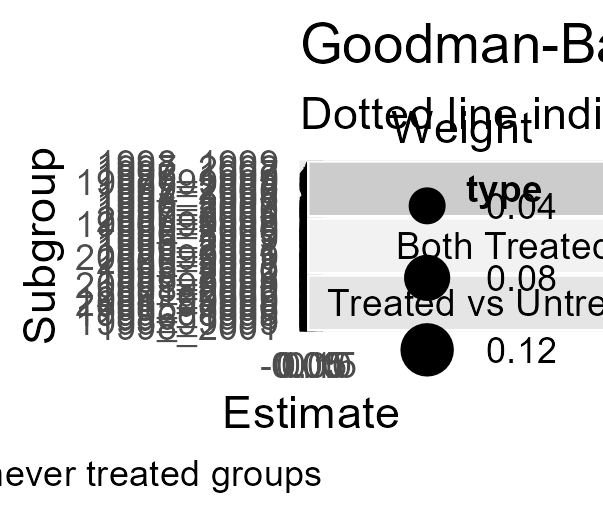

```{r setup, include=FALSE}
knitr::opts_chunk$set(echo = TRUE)
library(kableExtra)
```

\newpage

## Introduction

According to 2019 Survey for Drug use and Health, it was estimated that at least 51.5 million adults in the United States had some sort of mental illness. In the same year, 13.1 million were estimated to have a serious mental illness that resulted in serious functional impairment or interferes with at least one or more major life activity. Only 65.5% of those 13.1 million received any sort of mental health treatment in the past year. According to the Center for Disease Control's WISQARS Leading Causes of Death Report, Suicides are the second leading cause of death amongst people aged 10-34 and the fourth from 35-44 in the United States. Suicide rates have gradually increased over the past two decades, starting with 10.5 per 100,000 people to 14.2 per 10,000 in 2018. Suicide rates vary from state to state with both east and west coasts supporting low rates such as 7.4 per 100,000 while mid-western states suffer from rates as high as 25 per 100,000. Several Sources outline the negative effects not only through statistical life projections and productivity losses but more generally how devastating the preventable loss of life has on communities. [@klick2006; @lang2013]

The Federal Mental Health Parity Act of 1996 prevented group health plan and insurance issuers from offering less mental health or substance abuse coverage benefits compared to regular medical coverage. If a provider gave mental health services, they couldn't offer benefit limitations that they wouldn't otherwise give to their same medical/surgical coverage. Most states by 2002 instated mental health parity laws alongside further stipulations with varying degrees of restrictiveness and exemptions.

### Lang (2013)

My seminal paper, @lang2013 attempts to identify causal effects using difference-in-difference methods and fixed effects using two policy shocks, the aftereffects of the Federal Health Parity Act of 1996 and The Affordable Care Act of 2008. @lang2013 showed a statistically significant effect of a 4-7% decrease in suicide rate after policy implementation. I draw the same data detailed in the study but add years spanning from 1990 to 2016, 36 years of data in total. I run my difference in difference using regression unlike @lang2013 addition to conduct propensity score matching methods to achieve a better balance between covariates between control and treatment states.

### Parity laws:

 Any state implementing a law that requires insurance packages to include access to mental health services and to have those services at parity with any other physical service is flagged as a parity state. This type of law is the strongest type amongst the ones implemented and is the type expected to create an effect this study investigates. A less strict version of the parity law is the "mandated offering" law, which does not force insurance package providers to provide mental health services in the first place. This can be a crucial difference when it comes to further analysis but for the purposes of this study both are lumped together as a Parity state.

## Literature

## Data

My dataset pulls from the same sources from @lang2013 with the exception of one variable.

## Methods

## Results

## Discussion

## Conclusion

## Figures

\newpage

```{=latex}
\begin{table}[!htbp] \centering \renewcommand*{\arraystretch}{1.1}\caption{Summary Statistics}\resizebox{\textwidth}{!}{
\begin{tabular}{lrrrrrrr}
\hline
\hline
Variable & N & Wt. Mean & Wt. SD & Min & Pctl. 25 & Pctl. 75 & Max \\ 
\hline
Suicide Rate & 765 & 11.32 & 2.681 & 4.021 & 10.59 & 13.98 & 24.97 \\ 
Log suicide rate & 765 & 2.398 & 0.2415 & 1.392 & 2.36 & 2.638 & 3.218 \\ 
Unemployment rate & 765 & 5.573 & 1.421 & 2.108 & 4.267 & 6.192 & 11.23 \\ 
Bankrupcy rate per 100k & 765 & 435.6 & 169.5 & 79.46 & 287.6 & 516.5 & 1117 \\ 
Percent of workers in large Firms & 765 & 0.483 & 0.03803 & 0.2699 & 0.4291 & 0.5025 & 0.5711\\ 
\hline
\hline
\end{tabular}
}
\end{table}
```
```{=latex}
\begin{table}[!htbp] \centering \renewcommand*{\arraystretch}{1.1}\caption{Summary Statistics}\resizebox{\textwidth}{!}{
\begin{tabular}{lrrrrrrrrr}
\hline
\hline
Pre\_Post\_Parity & \multicolumn{3}{c}{No-Parity} & \multicolumn{3}{c}{Post-Parity} & \multicolumn{3}{c}{Pre-Pairty}  \\ 
 Variable & \multicolumn{1}{c}{N} & \multicolumn{1}{c}{Wt. Mean} & \multicolumn{1}{c}{Wt. SD} & \multicolumn{1}{c}{N} & \multicolumn{1}{c}{Wt. Mean} & \multicolumn{1}{c}{Wt. SD} & \multicolumn{1}{c}{N} & \multicolumn{1}{c}{Wt. Mean} & \multicolumn{1}{c}{Wt. SD} \\ 
\hline
Suicide Rate & 330 & 12.57 & 2.263 & 178 & 9.848 & 2.583 & 257 & 10.85 & 2.548 \\ 
Log suicide rate & 330 & 2.517 & 0.1696 & 178 & 2.255 & 0.2545 & 257 & 2.356 & 0.2385 \\ 
Unemployment rate & 330 & 5.338 & 1.288 & 178 & 5.134 & 1.113 & 257 & 6.131 & 1.568 \\ 
Bankrupcy rate per 100k & 330 & 442.5 & 188.5 & 178 & 476.1 & 169.3 & 257 & 401.3 & 137.3 \\ 
Percent of workers in large Firms & 330 & 0.4887 & 0.03845 & 178 & 0.4886 & 0.03846 & 257 & 0.4727 & 0.03511\\ 
\hline
\hline
\end{tabular}
}
\end{table}
```
```{=latex}
\begin{table}

\caption{Weighted Mean Suicide Rates of Treated and Nontreated States, Pre and Post Period}
\centering
\begin{tabular}[t]{lrrrr}
\toprule
Time Period Group & mean & st.err & sd & n\\
\midrule
NoTreatPost-Period & 12.2426 & 0.2118 & 2.0905 & 154\\
NoTreatPre-Period & 12.8921 & 0.2264 & 2.3786 & 176\\
Post-Period & 9.7867 & 0.2927 & 2.5778 & 203\\
Pre-Period & 11.0831 & 0.2616 & 2.4765 & 232\\
\bottomrule
\end{tabular}
\end{table}
```
```{=latex}
\begin{table}

\caption{Weighted Mean Log Suicide Rates of Treated and Nontreated States, Pre and Post Period}
\centering
\begin{tabular}[t]{lrrrr}
\toprule
Time Period Group & mean & st.err & sd & n\\
\midrule
NoTreatPost-Period & 2.4915 & 0.0165 & 0.1625 & 154\\
NoTreatPre-Period & 2.5413 & 0.0165 & 0.1732 & 176\\
Post-Period & 2.2485 & 0.0288 & 0.2537 & 203\\
Pre-Period & 2.3800 & 0.0241 & 0.2285 & 232\\
\bottomrule
\end{tabular}
\end{table}
```
```{=latex}
\begin{table}
\raggedleft
\caption{\small{Difference in Difference estimates of the impact of access to parity mandates on suicide rates}}
\label{tab:my_label}
 \begin{tabular}{ccccccc}
 \toprule
 \multicolumn{7}{c}{Panel A}\\ 
 \midrule
         State/ Type Period&  &  1990-1997&  &  1998-2004&  &difference between periods\\ 
         \midrule
         Access to Parity States&  &  11.083&  &  9.787
&  &-1.2964\\ 
         &  &  (.262)&  &  (.293)
&  &(0.2272)  \\ 
         &  &  [232]&  & [203]&  &\\ 
         No Parity States/ No Law States&  &  12.892
&  &  12.2426
&  &0.6495\\ 
 & & (0.226)
& & (0.212)
& &(0.2730)\\ 
 & & [154]& & [176]& &\\ 
 Difference between types of states& & -1.809& & -2.456     & &\\ 
 & & (0.2481)   & & (0.2541)   & &\\ 
 Difference in Difference& & & -.647& & &\\ 
 & & & (0.3552)  & & &\\
 \toprule
 \multicolumn{7}{c}{Panel B}\\
 \midrule
 State/ Type Period& & 1990-1997& & 1998-2004& &difference between periods
 \\\midrule
 Access to Parity States& & 2.380& & 2.249 
& &-.131\\
 & & (.024)& & 
(.029)& &(.0202)\\
 & & [232]& & [203]& &\\
 No Parity States/ No Law States& & 2.541
& & 2.492& &-.049\\
 & & (.0165)
& & 
(.0165)& &(.02422)\\
 & & [176]& & [154]& &\\
 Difference between types of states& & -.161& & 
-.243& &
\\
 & & (.022)& & (.0226)& &
\\
 Difference in Difference& & & -.0817***& & &
\\
 & & & (.032)& & &\\
 \bottomrule
    \end{tabular}
\small {Each cell contains the average suicide rate/log suicide rate for the specified group that are weighted by yearly state population. \\Standard errors are reported in parentheses; sample sizes are reported in brackets.\\**Significant at the 5\% level, ***significant at the 1\% level.
}
\end{table} 
```
```{=latex}

\begin{table}[htbp]
   \caption{The Two-way Fixed Effect Regressions on the Impact of Mental Health Parity Laws }
   \centering
   \begin{tabular}{lcccc}
      \tabularnewline \midrule \midrule
      Dependent Variable: & \multicolumn{4}{c}{Log Suicide Rate}\\
      Model:                         & (1)                     & (2)                     & (3)                     & (4)\\  
      \midrule
      \emph{Variables}\\
      D\_AccessToParity              & -0.0418$^{***}$         & -0.0411$^{***}$         &                         & -0.0461$^{**}$\\   
                                     & (0.0129)                & (0.0131)                &                         & (0.0186)\\   
      D\_NonParityLaw                & -0.0019                 &                         &                         &   \\   
                                     & (0.0134)                &                         &                         &   \\   
      `unemploymentrate`             & 0.0152$^{***}$          & 0.0152$^{***}$          & 0.0151$^{***}$          & 0.0155$^{***}$\\   
                                     & (0.0049)                & (0.0049)                & (0.0049)                & (0.0049)\\   
      Bankruptcy Per 100,000         & 0.0002$^{***}$          & 0.0002$^{***}$          & 0.0003$^{***}$          & 0.0002$^{***}$\\   
                                     & ($4.38\times 10^{-5}$)  & ($4.41\times 10^{-5}$)  & ($4.27\times 10^{-5}$)  & ($4.29\times 10^{-5}$)\\    
      Percent Working in Large Firms & 0.6413                  & 0.6406                  & 0.5382                  & 0.6499\\   
                                     & (0.4625)                & (0.4636)                & (0.4538)                & (0.4739)\\   
      D\_ParityLawPassed             &                         &                         & -0.0294$^{**}$          &   \\   
                                     &                         &                         & (0.0144)                &   \\   
      D\_Mandatedofferinglaws        &                         &                         & -0.0872$^{***}$         &   \\   
                                     &                         &                         & (0.0226)                &   \\   
      D\_MandatedifOffered           &                         &                         & -0.0196                 & -0.0220\\   
                                     &                         &                         & (0.0154)                & (0.0179)\\   
      D\_NoLaw                       &                         &                         &                         & -0.0043\\   
                                     &                         &                         &                         & (0.0148)\\   
      \midrule
      \emph{Fixed-effects}\\
      State                          & Yes                     & Yes                     & Yes                     & Yes\\  
      Year.x                         & Yes                     & Yes                     & Yes                     & Yes\\  
      \midrule
      \emph{Fit statistics}\\
      Observations                   & 765                     & 765                     & 765                     & 765\\  
      R$^2$                          & 0.94704                 & 0.94704                 & 0.94836                 & 0.94715\\  
      Within R$^2$                   & 0.21667                 & 0.21664                 & 0.23609                 & 0.21825\\  
      \midrule \midrule
      \multicolumn{5}{l}{\emph{Clustered (State) standard-errors in parentheses}}\\
      \multicolumn{5}{l}{\emph{Signif. Codes: ***: 0.01, **: 0.05, *: 0.1}}\\
   \end{tabular}
\end{table}
```
```{=tex}
\begin{table}[!h]
\caption{First Differences Regressions on the Impact of Mental Health Parity Laws}
\centering
\begin{tabular}{lllll}
\cline{1-5}
\multicolumn{1}{r}{} &
  \multicolumn{2}{c}{$\Delta$Log Crude Rate} &
  \multicolumn{2}{c}{$\Delta$Log Crude Rate} \\
\cline{1-5}
\multicolumn{1}{l}{$\Delta$Unemployment Rate} &
  \multicolumn{1}{r}{0.014} &
  \multicolumn{1}{l}{} &
  \multicolumn{1}{r}{0.014} &
  \multicolumn{1}{l}{} \\
\multicolumn{1}{l}{} &
  \multicolumn{1}{r}{(0.008)} &
  \multicolumn{1}{l}{} &
  \multicolumn{1}{r}{(0.008)} &
  \multicolumn{1}{l}{} \\
\multicolumn{1}{l}{$\Delta$Percent of Workers in Large Firms} &
  \multicolumn{1}{r}{-0.702} &
  \multicolumn{1}{l}{} &
  \multicolumn{1}{r}{-0.690} &
  \multicolumn{1}{l}{} \\
\multicolumn{1}{l}{} &
  \multicolumn{1}{r}{(0.647)} &
  \multicolumn{1}{l}{} &
  \multicolumn{1}{r}{(0.660)} &
  \multicolumn{1}{l}{} \\
\multicolumn{1}{l}{$\Delta$Bankruptcy per 100,000} &
  \multicolumn{1}{r}{-0.000} &
  \multicolumn{1}{l}{} &
  \multicolumn{1}{r}{-0.000} &
  \multicolumn{1}{l}{} \\
\multicolumn{1}{l}{} &
  \multicolumn{1}{r}{(0.000)} &
  \multicolumn{1}{l}{} &
  \multicolumn{1}{r}{(0.000)} &
  \multicolumn{1}{l}{} \\
\multicolumn{1}{l}{$\Delta$Access to Parity} &
  \multicolumn{1}{r}{-0.021} &
  \multicolumn{1}{l}{} &
  \multicolumn{1}{r}{-0.021} &
  \multicolumn{1}{l}{} \\
\multicolumn{1}{l}{} &
  \multicolumn{1}{r}{(0.012)} &
  \multicolumn{1}{l}{} &
  \multicolumn{1}{r}{(0.012)} &
  \multicolumn{1}{l}{} \\
\multicolumn{1}{l}{$\Delta$Non Parity Law} &
  \multicolumn{1}{r}{} &
  \multicolumn{1}{l}{} &
  \multicolumn{1}{r}{0.004} &
  \multicolumn{1}{l}{} \\
\multicolumn{1}{l}{} &
  \multicolumn{1}{r}{} &
  \multicolumn{1}{l}{} &
  \multicolumn{1}{r}{(0.015)} &
  \multicolumn{1}{l}{} \\
\multicolumn{1}{l}{Intercept} &
  \multicolumn{1}{r}{-0.007} &
  \multicolumn{1}{l}{**} &
  \multicolumn{1}{r}{-0.007} &
  \multicolumn{1}{l}{**} \\
\multicolumn{1}{l}{} &
  \multicolumn{1}{r}{(0.001)} &
  \multicolumn{1}{l}{} &
  \multicolumn{1}{r}{(0.001)} &
  \multicolumn{1}{l}{} \\
\multicolumn{1}{l}{$R^{2}$} &
  \multicolumn{1}{r}{0.14} &
  \multicolumn{1}{l}{} &
  \multicolumn{1}{r}{0.14} &
  \multicolumn{1}{l}{} \\
\multicolumn{1}{l}{N} &
  \multicolumn{1}{r}{714} &
  \multicolumn{1}{l}{} &
  \multicolumn{1}{r}{714} &
  \multicolumn{1}{l}{} \\
\multicolumn{1}{l}{Adjusted$R^{2}$} &
  \multicolumn{1}{r}{0.05} &
  \multicolumn{1}{l}{} &
  \multicolumn{1}{r}{0.05} &
  \multicolumn{1}{l}{} \\
\multicolumn{1}{l}{F Statistic} &
  \multicolumn{1}{r}{2.86} &
  \multicolumn{1}{l}{} &
  \multicolumn{1}{r}{2.50} &
  \multicolumn{1}{l}{} \\
\cline{1-5}
\end{tabular}

\footnotesize{
** p$<$.01, * p$<$.05
}
\end{table}
```
```{=tex}

\begin{table}[htbp]
\centering
\caption{Matched Table A}
\resizebox{\textwidth}{!}{%
\begin{tabular}{lcccc}
   \tabularnewline \midrule \midrule
   Dependent Variables:           & Crude Suicide Rate & Log Suicide Rate        & Crude Suicide Rate & Log Suicide Rate\\  
   Matching Model:                & Mahalanobis        & Mahalanobis             & Full with Probit   & Full with Probit \\  
   \midrule
   \emph{Variables}\\
   TreatPost                      & 0.060              & -0.015                  & -0.279             & -0.043$^{***}$\\   
                                  & (0.329)            & (0.028)                 & (0.176)            & (0.015)\\   
   `unemploymentrate`             & 0.229$^{*}$        & 0.027$^{**}$            & 0.121$^{**}$       & 0.014$^{***}$\\   
                                  & (0.126)            & (0.011)                 & (0.057)            & (0.005)\\   
   Bankruptcy Per 100,000         & 0.0007             & $5.64\times 10^{-5}$    & 0.003$^{***}$      & 0.0003$^{***}$\\   
                                  & (0.0006)           & ($4.79\times 10^{-5}$)  & (0.0005)           & ($4.25\times 10^{-5}$)\\    
   Percent Working in Large Firms & 6.05               & 0.539                   & -0.346             & 0.548\\   
                                  & (8.36)             & (0.788)                 & (4.43)             & (0.435)\\   
   \midrule
   \emph{Fixed-effects}\\
   State                          & Yes                & Yes                     & Yes                & Yes\\  
   Year.x                         & Yes                & Yes                     & Yes                & Yes\\  
   \midrule
   \emph{Fit statistics}\\
   Observations                   & 284                & 284                     & 765                & 765\\  
   R$^2$                          & 0.96644            & 0.96979                 & 0.94241            & 0.94692\\  
   Within R$^2$                   & 0.03924            & 0.06029                 & 0.14513            & 0.21481\\  
   \midrule \midrule
   \multicolumn{5}{l}{\emph{Clustered (State) standard-errors in parentheses}}\\
   \multicolumn{5}{l}{\emph{Signif. Codes: ***: 0.01, **: 0.05, *: 0.1}}\\
\end{tabular}%
}
\end{table}

\begin{table}[htbp]
\centering
\caption{Matched Table B}
\resizebox{\textwidth}{!}{%
\begin{tabular}{lcccc}
   \tabularnewline \midrule \midrule
   Dependent Variables:           & Crude Suicide Rate & Log Suicide Rate        & Crude Suicide Rate & Log Suicide Rate\\  
   Matching Model:                & Full with GLM     & Full with GLM            & Full with Cardinality & Full with  Cardinality\\  
   \midrule
   \emph{Variables}\\
   TreatPost                      & -0.279             & -0.043$^{***}$          & -0.103             & -0.038\\   
                                  & (0.176)            & (0.015)                 & (0.408)            & (0.038)\\   
   `unemploymentrate`             & 0.121$^{**}$       & 0.014$^{***}$           & 0.418$^{***}$      & 0.039$^{***}$\\   
                                  & (0.057)            & (0.005)                 & (0.136)            & (0.013)\\   
   Bankruptcy Per 100,000         & 0.003$^{***}$      & 0.0003$^{***}$          & 0.0002             & $-1.08\times 10^{-5}$\\    
                                  & (0.0005)           & ($4.25\times 10^{-5}$)  & (0.0009)           & ($8.48\times 10^{-5}$)\\    
   Percent Working in Large Firms & -0.346             & 0.548                   & 17.8$^{**}$        & 1.84$^{**}$\\   
                                  & (4.43)             & (0.435)                 & (8.07)             & (0.803)\\   
   \midrule
   \emph{Fixed-effects}\\
   State                          & Yes                & Yes                     & Yes                & Yes\\  
   Year.x                         & Yes                & Yes                     & Yes                & Yes\\  
   \midrule
   \emph{Fit statistics}\\
   Observations                   & 765                & 765                     & 168                & 168\\  
   R$^2$                          & 0.94241            & 0.94692                 & 0.97177            & 0.97352\\  
   Within R$^2$                   & 0.14513            & 0.21481                 & 0.12200            & 0.16782\\  
   \midrule \midrule
   \multicolumn{5}{l}{\emph{Clustered (State) standard-errors in parentheses}}\\
   \multicolumn{5}{l}{\emph{Signif. Codes: ***: 0.01, **: 0.05, *: 0.1}}\\
\end{tabular}%
}
\end{table}


\begin{table}[htbp]
\centering
\caption{Matched Table C}
\resizebox{\textwidth}{!}{%
\begin{tabular}{lcccc}
   \tabularnewline \midrule \midrule
   Dependent Variables:           & Crude Suicide Rate & Log Suicide Rate        & Crude Suicide Rate & Log Suicide Rate\\  
   Matching Model:                & Coarse-Exact Matching & Coarse-Exact Matching & Subclass           & Subclass\\  
   \midrule
   \emph{Variables}\\
   TreatPost                      & -0.156             & -0.027                  & -0.279             & -0.043$^{***}$\\   
                                  & (0.217)            & (0.020)                 & (0.176)            & (0.015)\\   
   `unemploymentrate`             & 0.108              & 0.018                   & 0.121$^{**}$       & 0.014$^{***}$\\   
                                  & (0.119)            & (0.012)                 & (0.057)            & (0.005)\\   
   Bankruptcy Per 100,000         & 0.002$^{**}$       & 0.0002$^{**}$           & 0.003$^{***}$      & 0.0003$^{***}$\\   
                                  & (0.0007)           & ($7.95\times 10^{-5}$)  & (0.0005)           & ($4.25\times 10^{-5}$)\\    
   Percent Working in Large Firms & -6.37              & -0.002                  & -0.346             & 0.548\\   
                                  & (7.16)             & (0.666)                 & (4.43)             & (0.435)\\   
   \midrule
   \emph{Fixed-effects}\\
   State                          & Yes                & Yes                     & Yes                & Yes\\  
   Year.x                         & Yes                & Yes                     & Yes                & Yes\\  
   \midrule
   \emph{Fit statistics}\\
   Observations                   & 319                & 319                     & 765                & 765\\  
   R$^2$                          & 0.96784            & 0.96903                 & 0.94241            & 0.94692\\  
   Within R$^2$                   & 0.07776            & 0.10345                 & 0.14513            & 0.21481\\  
   \midrule \midrule
   \multicolumn{5}{l}{\emph{Clustered (State) standard-errors in parentheses}}\\
   \multicolumn{5}{l}{\emph{Signif. Codes: ***: 0.01, **: 0.05, *: 0.1}}\\
\end{tabular}%
}
\end{table}

```





\newpage

## References
